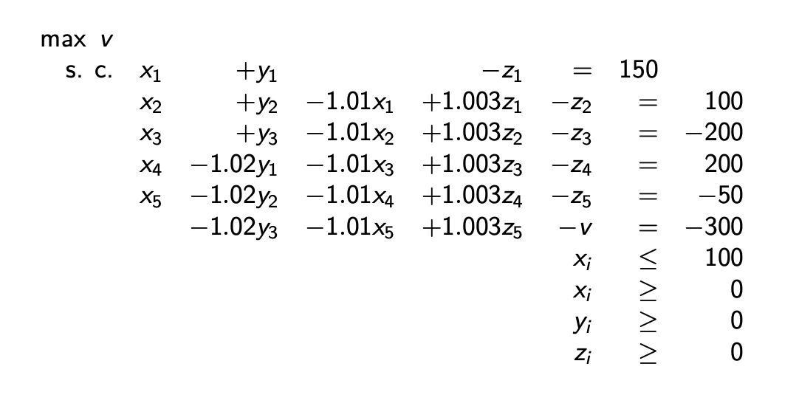

## LP models: asset/liability cash-flow matching

Solving Short-term financing problem(3.1) in the book Optimization Methods in Finance by Gerard CORNUEJOLS and Reha TUTUNCU. [link](https://www.amazon.ca/Optimization-Methods-Finance-Gerard-Cornuejols/dp/0521861705)

A company has the following short-term financing problem:

| Month       | Jan | Feb | Mar | Apr | May | Jun |
| :---        |:---:|:---:|:---:|:---:|:---:|---: |
|Net cash flow|-150 |-100 |200  |-200 |50   | 300 |       

Net cash flow requirements are given in thousands of dollars. The company has the
following sources of funds:
- a line of credit of up to $100k$ at an interest rate of $1$% per month;
- in any one of the first three months, it can issue 90-day commercial paper bearing a total interest of $2$% for the three-month period;
- excess funds can be invested at an interest rate of $0.3$% per month.

### Modeling the problem

The variables, in thousands of dollars:
- $x_i$, the amount used from the credit line at the end of month $i$, for $i = 1, \dots, 5$
- $y_i$, the amount of commercial paper issued at the end of month $i$, for $i = 1, \dots, 3$
- $z_i$, the amount remaining in the savings account at the end of  month $i$, for $i = 1, \dots, 5$
- $v$, the value of the company at the end of June.

The **objective function** is $v$, which we wish to maximize.

The **constraints** are of three types:
1. Cash inflows and outflows must be equal, each month.
2. There us an upper limit to the use of the credit line.
3. The decision variables $x_i$, $y_i$ and $z_i$ are non-negative.

### The Optimization Problem

